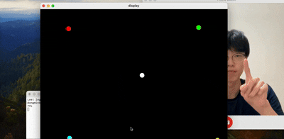

# **Escape From Finger Chaser**
MediaPipeによるAI手の認識（Python）と、高頻度な物理計算・描画（C++）をUDPソケット通信で同期させた、リアルタイム・チェイスゲームプロジェクトです。<br>
現在はビジュアルよりも、**「入力ジッターの補正」**や **「異言語間マルチプロセス通信」**といった**ゲームのコアシステム・アーキテクチャの構築**にこだわり抜いて開発しています。

## Demo


## 技術スタック
### 開発環境
- **OS**
    - macOS
- **Languages**
    - Python 3.12+
    - C++ 20+
- **Build Tool**
    - CMake 3.12

### ライブラリ & フレームワーク
- **Python**
    - `mediapipe` (0.10.35) : AIを用いたLIVE Hand Landmark Detection
    - `opencv-python` (4.13.0.92) : カメラ映像入及びイメージ処理
- **C++**
    - `SFML` (Simple and Fast Multimedia Library) : グラフィックUI及びSocket通信

## 特徴
### 1. リアルタイム・トラックング精度の追求
- **適応型ノイズ除去**: 1€ Filterを用いて、カメラの解像度や光源に依存しない**揺れのない**滑らかなレンダリングを実現しました。
- **物理シミュレーション**: 敵キャラクターの挙動に、単純追跡だけでなく、オイラー法を用いた予測アルゴリズムを導入することで、プレイヤーの動きに対する**追いつかれそうな緊張感**を演出しています。

### 2. システム設計
- **ハイブリッド・アーキテクチャ**: 画像認識プロセス（Python）とロジック・レンダリング(C++)をUDPで分離し、開発効率を求めました。
- **データ駆動型設計:** 接続情報やパス設定を`.env`ファイルで外部化し、コードを修正することなく環境変数を変更できる柔軟性を確保しています。

### 3. UXの最適化
- **解像度可変対応**: ウィンドウのリサイズに応じて座標変換行列を再計算し、常に正しいアスペクト比でトラッキングデータを反映させる設計にしました。

## Why This Technology?
このプロジェクトは、認識精度の追求とリアルタイムな操作感の両立を目指し、以下のような技術選定を行いました。

- **Python & C++ のハイブリッド構成**
    - **Python (`Mediapipe`/`OpenCV`)**: AIモデルの推論や画像処理において、開発効率を優先しました。
    - **C++ `(SFML)`**: 画像処理以外の「物理計算」「ゲームロジック」「高頻度レンダリング」において、Pythonでは回避できない速度低下を避けるため、実行性能に優れたC++を採用しました。
- **UDPによる通信**
    - 滑らかなリアルタイム操作感のためには、過去のデータよりも**最新の座標**が重要です。再送制御による遅延を許容できないため、速度を最優先するUDPを選択しました。
- **1€ Filterの自作実装**
    - 固定係数フィルタリングでは、手の動きが速い時の**遅延**と、止まっている時の**ジッター(揺れ)**を同時に解消できません。速度に応じてフィルタ強度が動的に変化する1€ Filterを実装することで、滑らかな操作体験を実現しました。

## Architecture & Program Flow
### Architecture
- Input : Mediapipeで検出した生の座標データ(`received_pos`)が入ります。x, y座標をfloat形式にパッキングしUDP通信でC++ロジック側に渡します。
- Processing
    - 渡されたデータの時間間隔(`dT`)を測るタイマー、速度を計算する数式、速度から精密にノイズを削る1€ フィルター(One Euro Filter)が結合されています。
    - 補正された現在座標に基づき、オイラー法(Euler method)を用いてnステップ後の位置を予測します。
- Output
    - プレイヤーやChaserの位置座標に基づき描画。
    - 補正された現在座標(`get_curr_pos`)とnステップ後の位置座標(`get_Euler_predict`)にChaserが向かい、Chaserの位置を更新

### Program Flow
0. .envから環境変数取得
- ここからはループ
1. Mediapipeから人差し指先の座標を取得
2. float形式にパッキングしUDP送信
3. ユーザーによるプログラム終了確認→終了
4. UIウィンドウサイズ変化確認　→　視点変更
5. UDP受信(座標データ)確認　→　1Eurofilterノイズ補正
6. 補正及び予測座標に基づきChaser情報更新
7. 描画(Rendering)
8. オブジェクト間当たり判定
- 繰り返し
9. 終了

## インストール方法 & 使い方
- ⚠️MacOS開発環境であるため、他のOSについてはTest未実施
    - 以下もMacOSを基準に説明しています。
 - **Python3.10以上**
 - **C++20以上**

### 0. ダウンロード (Download)
- ダウンロード方法は以下の二つです。
#### **Method A: Git Clone（おすすめ）**
```bash
git clone https://github.com/dngmin/Escape-From-Finger-chaser.git
```
- ダウンロード先を指定したい場合は以下を先に行なってください。

#### Method B: ZIPファイルダウンロード
1. [Github レポジトリ](https://github.com/dngmin/Escape-From-Finger-chaser)右上の緑[<> Code]ボタンをクリックしてください。
2. [Download ZIP]を選択し、圧縮ファイルをダウンロードしてください。
3.解凍の後、フォルダへ移動してください。
#### **⚠️ A,Bどれもclone,解凍の後にはフォルダに移動が必要**
```bash
cd Path/Escape-From-Finger-chaser # e.g. cd desktop/user/Escape-From-Finger-chaser
```

### 1. 環境変数設定(.env)
- プロジェクトディレクトリに**.env**ファイルを生成し、以下のパラメータを指定してください。
    - host_number
    - port_number
    - model_path
- 書き方の例
```
host_number = 127.0.0.1
port_number = 5005
model_path = models/hand_landmarker.task
```

### 2. ライブラリ設定
- Python
```bash
pip install -r "requirements.txt"
#もしくは
python -m pip install -r "requirements.txt"
```
- C++
```bash
brew install sfml
```

### 3. CMake
```bash
# 1. ビルド用ディレクトリの作成と移動
mkdir build && cd build

# 2. CMakeの実行(Makefileの生成)
cmake ..

# 3. コンパイルの実行
make
```

### 4. 実行
- 現在はそれぞれのスクリプトを手動で実行する必要があります。(今後改善予定)
```bash
# 両方ともプロジェクトディレクトリから実行する必要がある。

# ターミナル 1: Python Hand tracking実行
python src/python/hand_tracking.py

# ターミナル 2: C++ UI実行
./build/effc
```

## Current Challenges & Future Improvements
- 進行中
    - 敵の動き追加
        - [x] 単純追跡
        - [x] オイラー法
        - [ ] ランダム動き
        - [ ] 未定
- 予定（※ 優先度順ではありません）
    - python mediapipeのrunning_modeをLIVE_STREAMに変更
        - call backを用いてデータ送信をmain loopから外せる
    - hand_tracking.pyとmain.cppを同時に実行するファイル作成
    - edgeでの異常の動き発生対策
    - 高速で手を動かすと生じるフレームドロップ及びテレポート対策
    - chaserたちの位置が重なる時での対策
    - プレイヤーが止まっているとき生じる意図してないchaser騙し対策
    - Program Flowをmermaidに変更
    - ビジュアルアップグレード(背景、プレイヤー、敵など)
    - C++ヘッダーファイルで前方宣言を使用検討
    - ゲームオーバーエフェクト
    - プログラム開始と同時にスタート、敵に当たると即終了によるUX低下改善
        - 本ゲームスタート前のロビー画面
        - 終了エフェクト及びゲームオーバー画面