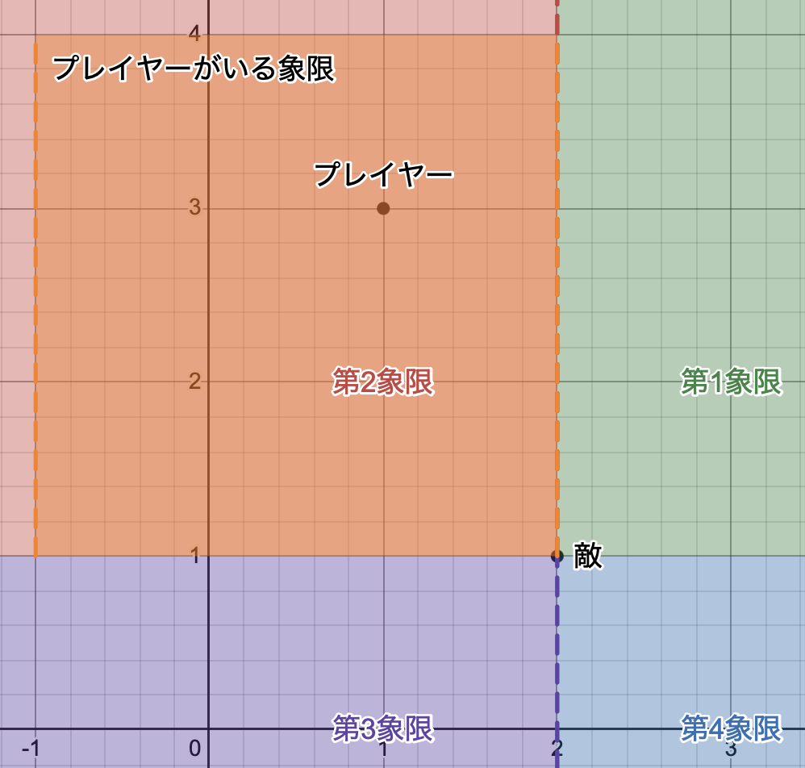

# 敵キャラクターの追跡アルゴリズム詳細

本プロジェクトの敵キャラクター（チェーサー）には、単にプレイヤーの座標を追いかけるだけでなく、物理演算と座標系を応用した以下の2つのアルゴリズムを組み合わせて導入しています。これにより、プレイヤーが「常に執拗に狙われている」という高い緊張感を演出しています。

---

## 1. オイラー法を用いた予測アルゴリズム（先読み）

プレイヤーの「現在の位置」ではなく、「少し未来の予測位置」を狙って移動する仕組みです。

### 仕組み
毎フレーム、プレイヤーの速度と加速度から未来の座標を近似計算（オイラー法）しています。
- プレイヤーの現在の速度を $v$、加速度を $a$、微小時間を $\Delta t$ とすると、次のフレームの速度 $v_{next}$ と位置 $x_{next}$ は以下の式で更新されます。

$$v_{next} = v + a \cdot \Delta t$$
$$x_{next} = x + v_{next} \cdot \Delta t$$

さらに、$n$ ステップ後の位置 $x_{n}$ は以下の式で更新されます。

$$\Delta T = n \cdot \Delta t$$
$$x_{n} = x + v_{next} \cdot \Delta T$$

この計算により、プレイヤーが急に方向転換しても、敵がその慣性を予測して回り込むような、賢くリアルな追跡挙動を実現しています。

---

## 2. 動的座標系ベースの相対乱数アルゴリズム（不規則性）

直線的な追跡だけだと敵の動きが単調になり、セーフゾーンが見つかりやすくなってしまいます。そこで、敵の動きに「不規則性」を持たせるために独自の乱数アルゴリズムを構築しました。

### 仕組み
1. **動的座標系の定義**
   - 移動する敵（チェーサー）自身を常に原点 $(0, 0)$ とする「動的座標系」を毎フレーム展開します。

*※絶対座標系から離れた敵の位置（図では $(2,1)$ ）を基準に、相対的な4つの象限を展開します。*

2. **プレイヤー所属象限の特定（相対座標）**
   - この座標系において、プレイヤーが第1〜第4象限のどこに位置しているかを相対的に判定します。
3. **ターゲット座標のランダム生成**
   - プレイヤーがいる象限（例：図のようにプレイヤーが左上にいれば第2象限）の中限定で、敵からの相対的なランダム座標（目標点）を生成します。

### 効果
これにより、敵は「プレイヤーがいる方向のエリア」に向かう不規則な動きを見せます。結果として、プレイヤーは「次に敵がどこにステップを踏むか読めない」というシンプルで強力な緊張感を味わうことになります。