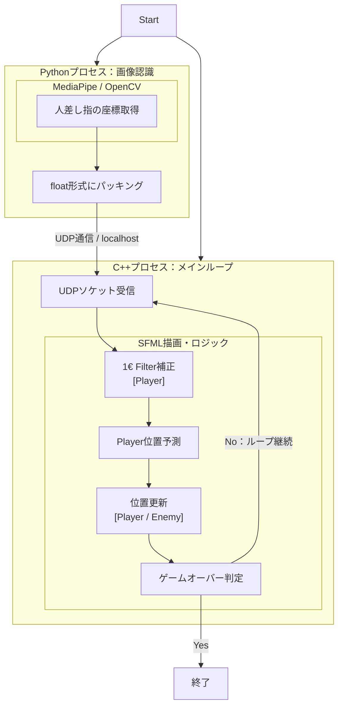

```mermaid
flowchart TD
    Start[Start]
    GameOver[終了]

    subgraph Python [Pythonプロセス：画像認識]

        subgraph ps[MediaPipe / OpenCV]
        P1[人差し指の座標取得]
        end

    P2[float形式にパッキング]
    end

    subgraph C++ [C++プロセス：メインループ]
    C1[UDPソケット受信]
        subgraph cs[SFML描画・ロジック]
        C2["1€ Filter補正\n[Player]"]
        C3[Player位置予測]
        C4["位置更新\n[Player / Enemy]"]
        C5[ゲームオーバー判定\n]
        end

    end

    Start --> Python 
    Start --> C++

    P1 --> P2
    P2 --UDP通信 / localhost--> C1

    C1 --> C2
    C2 --> C3
    C3 --> C4
    C4 --> C5
    C5 -- Yes --> GameOver
    C5 -- No：ループ継続 --> C1
```